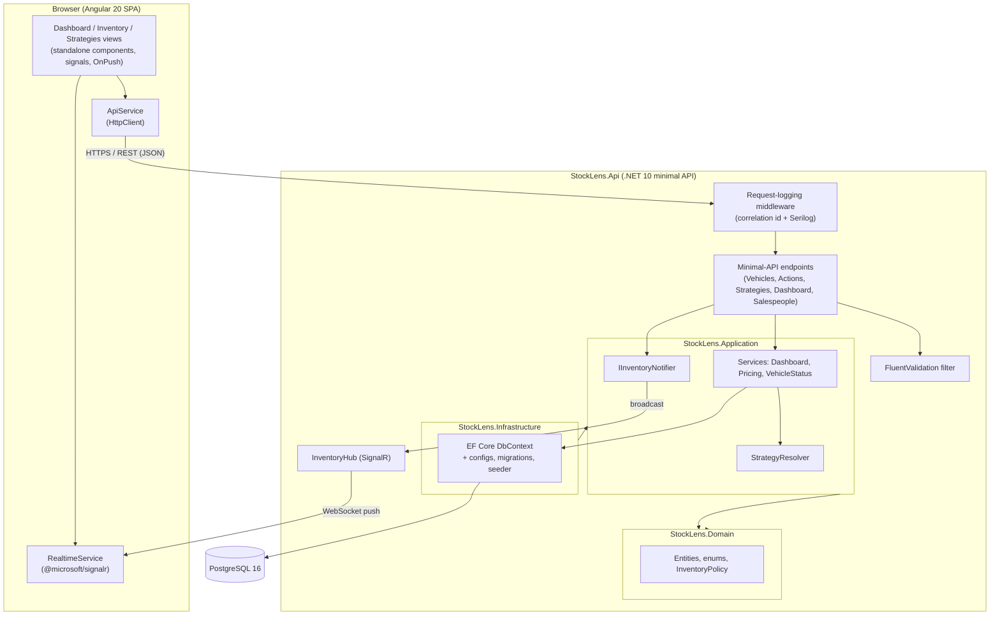

# StockLens: System Design Document

**Project:** StockLens: AI-powered Intelligent Inventory Dashboard for automotive dealerships
**Status:** As-built (reflects the current implementation, with a roadmap where noted)
**Last updated:** 2026-07-18

---

## 1. Purpose and scope

StockLens gives a dealership real-time visibility into its vehicle inventory. It surfaces aging
stock, moves vehicles through their lifecycle with an audit trail, resolves pricing against
business strategies on the fly, and reports sales-team and dashboard KPIs. Every change made by
one user is pushed live to every open dashboard.

This document describes the architecture that delivers those capabilities: the components and
their roles, how data flows through the system, the technologies chosen and why, the observability
approach, and how generative AI was used during the design phase.

---

## 2. Architecture overview

StockLens is a two-tier application: an Angular single-page app talking to a .NET minimal API,
with PostgreSQL for storage and SignalR for real-time push. The backend follows Clean
Architecture, so the dependency direction always points inward toward a framework-free domain.

Dependency rule: `Api` and `Infrastructure` depend on `Application`, `Application` depends on
`Domain`, and `Domain` depends on nothing. The API composes the graph at startup through
dependency injection.

---

## 3. Components and their roles

### 3.1 Frontend (`StockLens.App`, Angular 20)

| Component | Role |
| --- | --- |
| **Dashboard view** | Renders KPIs, the stock-by-make breakdown, top sales, and the monthly sales trend (Chart.js). Subscribes to live dashboard updates. |
| **Inventory view** | Filterable, sortable, paged vehicle list with aging highlighting; drill-down to a vehicle detail with status workflow, actions, and effective pricing. |
| **Strategies view** | Create, edit, and delete business strategies at factory, vehicle-type, or single-vehicle scope. |
| **ApiService** | The single place that holds `HttpClient`. Every REST call goes through it, returning typed models. |
| **RealtimeService** | Owns the SignalR connection to `/hubs/inventory`, exposes server-pushed events as Angular signals plus subscription callbacks, and handles automatic reconnect. |
| **ToastService / component** | Surfaces live changes as non-blocking notifications. |

All components use standalone bootstrapping, Angular signals for state, and `OnPush` change
detection. Business logic lives in services, not components.

### 3.2 API host (`StockLens.Api`)

| Component | Role |
| --- | --- |
| **Program.cs** | Composition root: wires Serilog, DI, JSON options, SignalR, CORS, Swagger, applies EF migrations and seeds on startup, and maps endpoints. |
| **Endpoints** | Minimal-API route groups (Vehicles, Actions, Strategies, Dashboard, Salespeople) using typed `Results`. Endpoints orchestrate; they do not hold domain rules. |
| **ValidationFilter** | Runs FluentValidation on request DTOs before the handler executes, returning a `400` with a problem body on failure. |
| **RequestLoggingMiddleware** | Assigns a per-request correlation id, pushes it into the Serilog log context, and emits structured start/complete/failure entries with elapsed time and status code. |
| **InventoryHub / SignalRInventoryNotifier** | The hub is the client-facing endpoint; the notifier implements `IInventoryNotifier` and broadcasts minimal DTO payloads to all connected dashboards. |

### 3.3 Application layer (`StockLens.Application`)

Holds use-case logic behind interfaces, with no framework or database coupling beyond EF Core
abstractions.

- **DashboardService**: builds the dashboard summary (KPIs, stock-by-make, top sales, sales trend) using projection queries.
- **VehiclePricingService**: resolves the effective discount per vehicle so list and detail prices always reflect the applicable strategy. Loads all strategies once and resolves in memory, so a page of vehicles costs a single query.
- **VehicleStatusService**: validates lifecycle transitions (Open, Deposited, Hold, Sold), captures required evidence, and records an audit entry per change.
- **StrategyResolver**: picks the most specific in-effect strategy for a vehicle (Vehicle over VehicleType over Factory).
- **DTOs, mapping, validators, and abstractions** (`IApplicationDbContext`, `IInventoryNotifier`, `IStrategyResolver`).

### 3.4 Domain layer (`StockLens.Domain`)

Entities (`Vehicle`, `BusinessStrategy`, `Salesperson`, `SalesRecord`, `VehicleAction`,
`VehicleStatusChange`), enums, and pure business rules such as `InventoryPolicy.AgingThresholdDays`
(90 days) and `Vehicle.DaysInInventory` / `IsAgingStock`. No dependency on any other project.

### 3.5 Infrastructure layer (`StockLens.Infrastructure`)

`ApplicationDbContext`, EF Core entity configurations, migrations, and the `DatabaseSeeder` that
loads representative data (in-stock, deposited, held, and aging vehicles; salespeople; sales
history; strategies at every scope). Implements `IApplicationDbContext` for the application layer.

### 3.6 Data store

PostgreSQL 16, run locally through Docker Compose (host port 5433) and intended for Azure Database
for PostgreSQL in a hosted environment.

---

## 4. Data flow

### 4.1 Read path (loading the dashboard)

1. A component calls `ApiService.getDashboard()`, which issues `GET /api/dashboard/summary`.
2. The request passes through the correlation-id middleware, then reaches the dashboard endpoint.
3. `DashboardService` runs projection queries (`AsNoTracking`) against PostgreSQL: only the
   columns needed for each KPI are selected, and stock-by-make and the sales trend are aggregated
   in the database.
4. The endpoint returns a `DashboardSummaryDto` as camelCase JSON.
5. The component stores it in a signal; the view re-renders under `OnPush`.

### 4.2 Write path with live broadcast (changing a vehicle's status)

1. The user submits a status change; `ApiService` issues `POST /api/vehicles/{id}/status`.
2. The validation filter checks the request DTO.
3. `VehicleStatusService` validates the transition, applies it, writes the status-change audit
   row, and saves.
4. The endpoint calls `IInventoryNotifier.VehicleChangedAsync(...)` and
   `DashboardChangedAsync(...)` with the freshly recomputed summary.
5. `SignalRInventoryNotifier` broadcasts `VehicleChanged` and `DashboardChanged` to all clients
   over the hub.
6. Every connected `RealtimeService` receives the push, updates its signals, and fires
   subscription callbacks; the affected views and a toast update live without a refetch.
7. The originating HTTP call also returns the updated vehicle to its caller.

The same broadcast pattern applies to vehicle create/update, action create/update, and strategy
create/update/delete. Payloads are the minimal DTO for the changed entity, not the whole dataset.

### 4.3 Derived pricing

List price is stored; the discount is not. On every read, `VehiclePricingService` resolves the
effective strategy and computes `discountPercent` and `netPrice`. This keeps prices correct when a
strategy is added, edited, or expires, with no stale denormalized values to reconcile.

---

## 5. Technology choices and justifications

| Area | Choice | Why |
| --- | --- | --- |
| Backend runtime | **.NET 10, ASP.NET Core Minimal API** | Low-ceremony endpoints, strong typing, first-class async, and native SignalR support. Minimal APIs avoid the boilerplate of MVC controllers for a focused API surface. |
| Architecture | **Clean Architecture (layered)** | Keeps the domain free of framework and database concerns, which makes business rules testable in isolation and protects them from infrastructure churn. |
| ORM | **EF Core 10** | Productive querying with LINQ, migrations, and projection support. Read queries use `AsNoTracking` and `Select` projections to limit round trips and allocations. |
| Database | **PostgreSQL 16** | Chosen for this project as a capable, open, no-license-cost relational store with strong indexing and case-insensitive search (`ILIKE`). Runs anywhere via Docker and maps cleanly to a managed cloud instance. |
| Real-time | **SignalR + `@microsoft/signalr`** | Server-push over WebSockets fits a live dashboard better than polling. The client library handles transport negotiation and automatic reconnect. Push is server-driven; clients never invoke hub methods. |
| Validation | **FluentValidation** | Keeps validation rules declarative and out of endpoint handlers, applied uniformly through a filter. |
| Logging | **Serilog** | Structured logging with enrichment (correlation id) and pluggable sinks. |
| Frontend | **Angular 20, standalone components, signals** | Modern Angular without NgModules. Signals give fine-grained reactivity that pairs naturally with SignalR push and `OnPush` change detection for efficient rendering. |
| Charts | **Chart.js** | Lightweight, dependency-free charting for the KPI and sales-trend visuals. |
| API docs | **Swashbuckle / Swagger UI** | Interactive API surface for development and manual testing. |
| Local infra | **Docker Compose** | One command brings up a consistent PostgreSQL instance for every developer. |
| Testing | **xUnit + WebApplicationFactory (backend), Karma/Jasmine (frontend)** | Domain rules covered by fast unit tests; endpoints covered by integration tests against a real host. |

**Deliberate deviations from the aspirational stack.** The project's standards documents list SQL
Server, Angular Material with Signal Store, and OpenTelemetry. Those were consciously set aside for
now in favor of PostgreSQL, custom SCSS with plain signals, and Serilog-only logging. Section 6
covers the observability roadmap; the UI is styled to a bespoke reference design, with a themed
Material migration tracked as future work.

---

## 6. Observability strategy

### 6.1 Logging (implemented)

- **Structured logging with Serilog**, configured in `Program.cs` and driven by the `Serilog`
  section of `appsettings`. Console sink today; additional sinks (file, Seq, Application Insights)
  plug in without code changes.
- **Per-request correlation id.** `RequestLoggingMiddleware` reads or generates an
  `X-Correlation-Id`, echoes it back on the response, and pushes it into the Serilog `LogContext`
  so every log line within a request carries the same id. This lets a single dashboard action be
  traced across all the log entries it produced.
- **Request lifecycle logging.** Each request emits a structured "Starting" entry and a
  "Completed" entry with method, path, status code, and elapsed milliseconds; failures log an
  error with the exception and timing.
- **Domain-event logging.** Mutation endpoints (vehicle create/update, action create/update,
  strategy create/update/delete, status change) log structured events with the entity id and key
  fields, using a per-endpoint log category. Sensitive data is never logged.

### 6.2 Metrics and tracing (roadmap)

The current build focuses on logging. The planned path, aligned with the project's target stack:

- **Metrics**: expose request rate, latency, and error counts, plus domain KPIs such as aging-stock
  count, via OpenTelemetry metrics to a Prometheus-compatible endpoint or Azure Monitor.
- **Distributed tracing**: adopt OpenTelemetry tracing so a request can be followed across the API,
  EF Core (database spans), and the SignalR broadcast. The correlation id already in place gives a
  natural bridge into trace context.
- **Centralized sink**: ship logs, metrics, and traces to Azure Application Insights in a hosted
  environment, with dashboards and alerting on error rate and latency.

### 6.3 Health and diagnostics (implemented)

The API exposes health endpoints built on ASP.NET Core health checks:

- **`/health`**: full report. Runs every registered check and returns a JSON body with the overall
  status, total duration, and a per-check breakdown (name, status, duration, description).
- **`/health/ready`**: readiness probe. Runs only checks tagged `ready`, currently a database
  reachability check (`CanConnectAsync`), so an orchestrator routes traffic only once the app can
  serve it.
- **`/health/live`**: liveness probe. Dependency-free, so it reports healthy whenever the process
  is running and a failing database does not trigger a needless restart.

Swagger UI remains available in development for manual endpoint exercise.

---

## 7. How GenAI assisted in the design phase

Generative AI (Claude, via Claude Code) was used as a design and implementation partner throughout,
with human review and final judgment on every decision. Concretely:

- **Standards as executable context.** The team encoded its engineering standards as a project
  `CLAUDE.md` and a set of skills (project-standards, dotnet-clean-api, angular-enterprise,
  feature-generator, inventory-domain-expert, code-reviewer). The AI reads these on each task, so
  generated code starts aligned with Clean Architecture, minimal APIs, signals, and the other
  house rules rather than needing to be corrected afterward.
- **Architecture and domain modeling.** AI helped shape the layered structure, the vehicle
  lifecycle state model (Open, Deposited, Hold, Sold), the aging-stock rule, and the
  strategy-resolution precedence (Vehicle over VehicleType over Factory). It proposed options and
  trade-offs; a human chose among them.
- **Design decisions where human judgment overrode the AI's default.** The standards the AI was
  given assumed SQL Server, Angular Material with Signal Store, and OpenTelemetry. During design,
  the team deliberately kept PostgreSQL, a custom SCSS UI with plain signals, and Serilog-only
  logging. These deviations were made explicitly and recorded, which is the intended pattern: the
  AI accelerates the work, and the engineers own the decisions.
- **Implementation and review acceleration.** AI drafted endpoints, services, EF configurations,
  DTOs, validators, and tests, and was used for review passes against the standards (for example,
  applying `OnPush` across components and `AsNoTracking` across read queries).
- **Documentation.** This document, the README, and code comments were drafted with AI assistance
  and edited by a human, following a house prose style (for instance, no em dashes) to keep the
  writing readable and consistent.

The guiding principle: use GenAI to move faster on scaffolding, options, and review, while keeping
architectural authority and correctness checks with the engineering team.

---

## 8. Cross-cutting concerns

- **Security**: all client input is validated (FluentValidation); EF Core parameterizes queries;
  `ILIKE` search terms escape wildcard characters; CORS is restricted to the configured app
  origin with credentials allowed only for the SignalR socket; secrets stay in configuration, not
  source, and no sensitive data is logged.
- **Performance**: read queries project only needed columns and run `AsNoTracking`; aggregations
  run in the database; a page of vehicles resolves pricing with a single strategy load; SignalR
  payloads carry only the changed entity.
- **Consistency**: derived values (discount, net price, aging) are computed on read, so there is no
  denormalized state to fall out of sync.
- **Testability**: the domain is dependency-free and unit-tested; endpoints are integration-tested
  against a real host through `WebApplicationFactory`.

---

## 9. Deployment view (target)

| Tier | Local | Hosted (target) |
| --- | --- | --- |
| Web app | `ng serve` on 4200 | Static hosting / CDN |
| API + hub | Kestrel on 5080 | Azure App Service (with Azure SignalR Service for scale-out) |
| Database | PostgreSQL 16 in Docker (5433) | Azure Database for PostgreSQL |
| Secrets | `appsettings.Development.json` | Azure Key Vault |
| Telemetry | Serilog console | Serilog + OpenTelemetry to Azure Application Insights |

Migrations are applied on API startup, so a deployment rolls the schema forward with the app.
